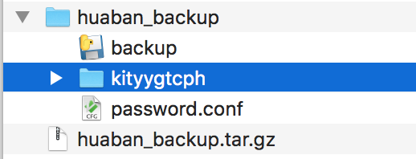

## 花瓣备份指南

下载备份程序 [backup](http://baidu.com)，下载完成后双击即可解压

进入解压后的文件夹，双击 `backup` 程序则会启动如下程序。

输入花瓣用户名和密码，点击开始备份，你的画板图片就会开始备份了。

开始备份后会在刚才解压的文件生成一个对应花瓣账户的文件夹（每个人都不一样，图片中是 `kityygtcph`）。同时输入的用户和密码会直接存储在本地，后续如果需要再同步直接启动程序即可，不需要输入用户密码（该备份程序不会上传任何信息）。接下来你只需要倒杯水，等待图片备份完成了。

## FAQ

* 登陆时出错：账户 Not Found

  请先确保用户名和密码输入是否正确。如果输入正确，查看一下浏览器是否已经登陆过账户，退出登陆的花瓣账户再启动备份程序即可。

* 登陆时出错：被系统判断为机器人

  

  使用浏览器登陆花瓣账号 （http://login.meiwu.co） 解除限制即可;或者等待一段时间再重试。